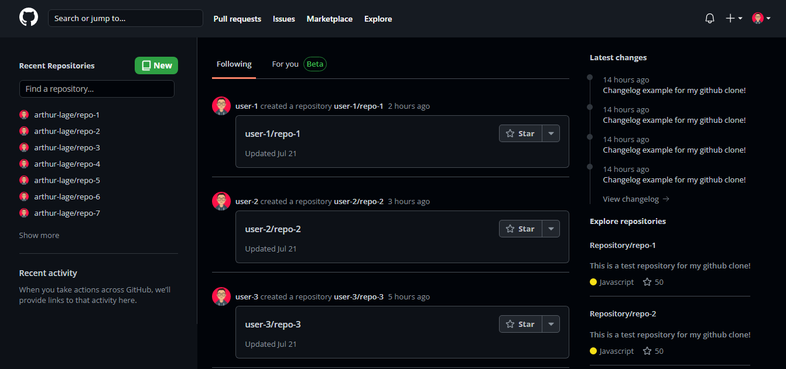
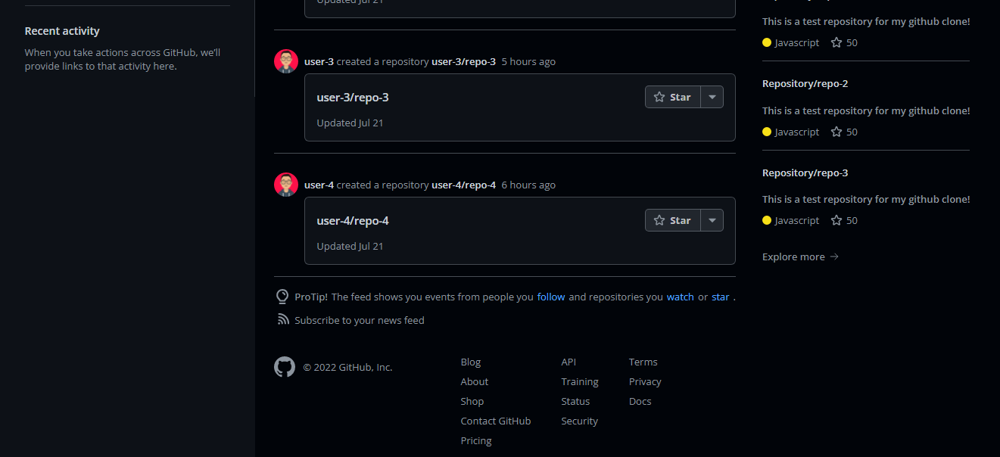
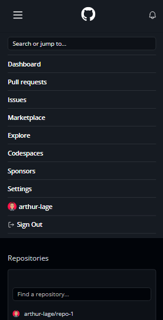
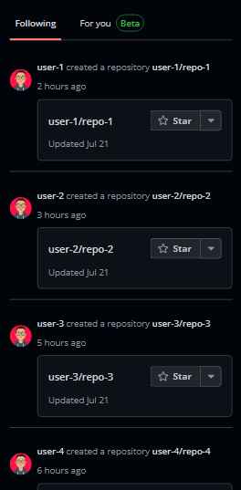
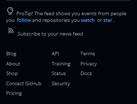

# Github

## ✉ About

A responsive clone of the homepage of GitHub, using ReactJS.

⚠ IMPORTANT: This project was made for educational purposes only. All rights are reserved to Github. ⚠

## 🌆 Images



<div style="display: flex">
  
  
  
</div>

## ⚠ Requirements

In order to run the project, you will need:

- Node
- A web browser (Chrome, Firefox, Edge, etc...)

## 💻 Technologies Used

### FRONTEND

- ReactJS
- Typescript
- Sass
- CSS Modules
- Vite

### EDITOR

- Visual Studio Code

## ⬇ How to download the project

```bash

git clone https://github.com/arthur-lage/github-clone.git

cd github-clone

npm install

npm run dev
  
```

## 🔗 How to use the app

If you wish to test the application, click the link below:

[Github](https://github-al.vercel.app)
